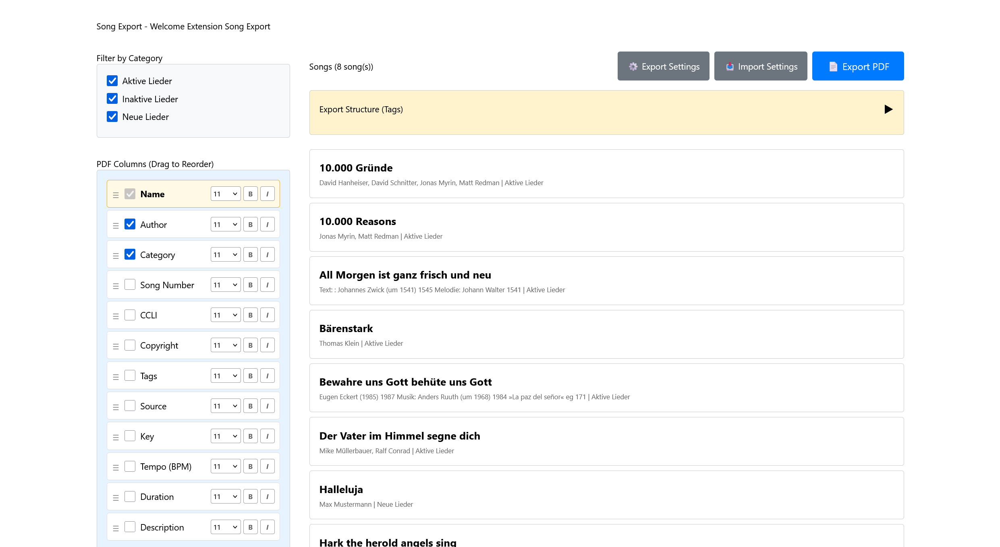
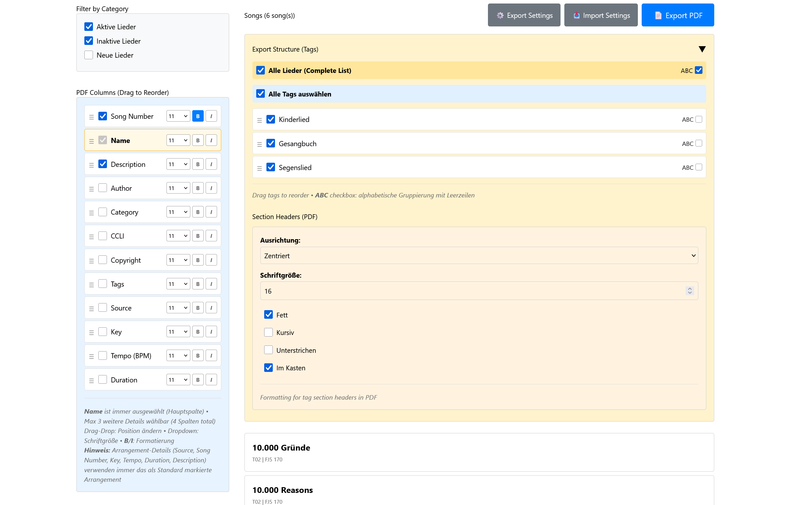
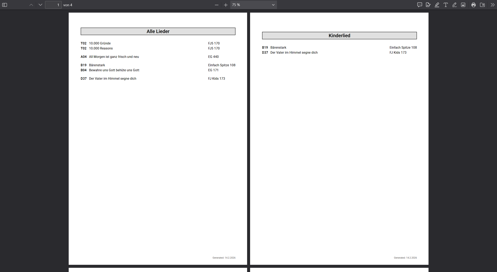

# Song Export Extension for ChurchTools

Export songs from ChurchTools to a clean, configurable PDF. This extension supports rich filtering, drag-and-drop ordering, per-column formatting, and reusable settings.

## Features

- Export songs to PDF with custom columns and formatting
- Choose up to 4 columns (Name plus up to 3 details)
- Drag-and-drop ordering for tags and details
- Alphabetical grouping per section
- Section headers with styling options
- Settings export/import (JSON)
- Responsive layout for desktop and mobile

Supported detail fields:
`name`, `author`, `category`, `sourceReference`, `ccli`, `copyright`,
`tags`, `source`, `key`, `tempo`, `duration`, `description`

## Requirements

- ChurchTools admin access (to install extensions)
- Node.js and npm (for local development)

## Quick Start

1. Install the extension in ChurchTools (Admin -> Extensions -> Upload ZIP).
2. Open the extension from the ChurchTools menu.
3. Select categories and tags.
4. Choose the PDF columns and formatting.
5. Export the PDF.

## Screenshots





## Configuration

Copy `.env-example` to `.env` and fill in your values:

```dotenv
VITE_KEY=songs_export
VITE_BASE_URL=https://xyz.church.tools
VITE_USERNAME=your_username
VITE_PASSWORD=your_password
```

Do not commit `.env`. It is listed in `.gitignore` by default.

The menu name shown to users is configured in ChurchTools Admin (not in code).

## Development

Install dependencies:

```bash
npm install
```

Start the dev server:

```bash
npm run dev
```

If the API calls are blocked by CORS, allow your local dev origin in ChurchTools
Admin -> System Settings -> Integrations -> API -> CORS.

Safari note: If login works in Chrome but not in Safari, it is usually due to
cookie handling. Use a Vite proxy so API calls go through your local server
(`/api -> https://xyz.church.tools`) and consider HTTPS for local dev.

## Build and Deploy

Build production assets:

```bash
npm run build
```

Package the extension:

```bash
npm run deploy
```

The ZIP file is created in the `releases/` folder.

## Notes

- Maximum of 4 columns (Name plus 3 details).
- Default arrangement is used when a song has multiple arrangements.
- Settings export/import lets you switch between PDF templates quickly.

## Support

For ChurchTools API questions, see the forum: https://forum.church.tools
